## Examples for chapter 1: synthetic signals

* ex1_01.grc: basic flowgraph with sine wave (real signal) source and oscilloscope

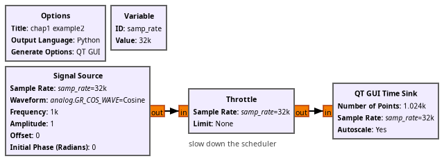

* ex1_02.grc: basic flowgraph with sine wave (real signal) source and oscilloscope + spectrum analyzer

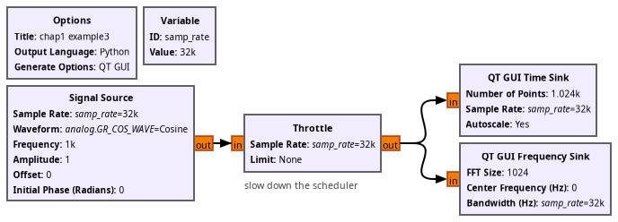

* ex1_03.grc: complex quantity display in time domain (oscilloscope)

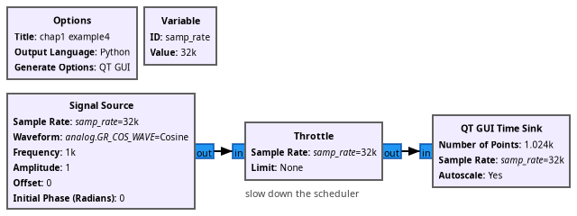

* ex1_04.grc: complex quantity display in time domain (oscilloscope) and frequency domain (spectrum analyzer) with the signal frequency dynamically tunable with a slider (Qt GUI Range)

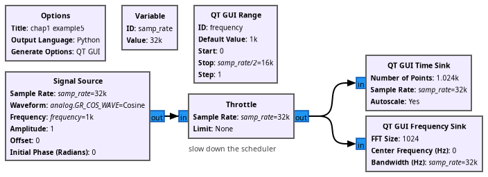

* ex1_05.grc: decimation of a complex signal to illustrate the impact of aliasing

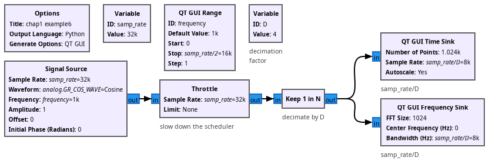

* ex1_06.grc: GRAVES acquisition flowchart with cascaded low-pass filters for decimating without aliasing

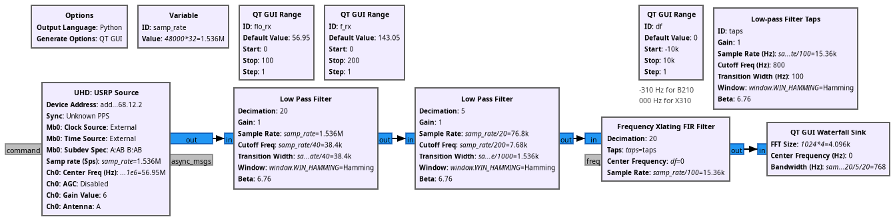

* ex1_07.grc: noise accumulation at baseband when decimating without low-pass filtering

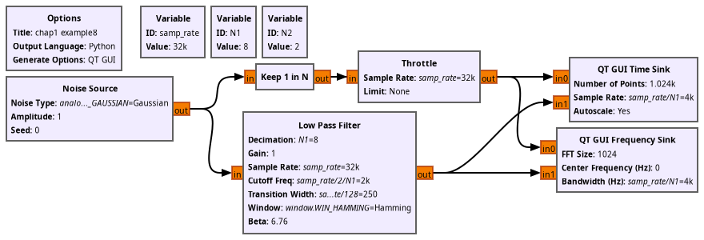

* ex1_08.grc: band-pass filter characterization by a flat-spectrum noise source

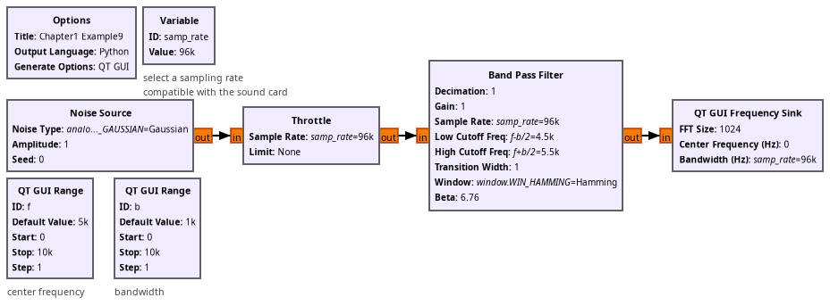

* ex1_09.grc: translating (Xlating) FIR filter

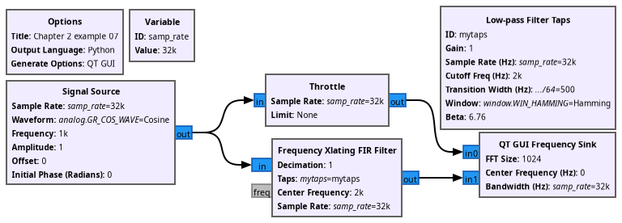

* ex1_10.grc: impact of quantization on the baseline noise

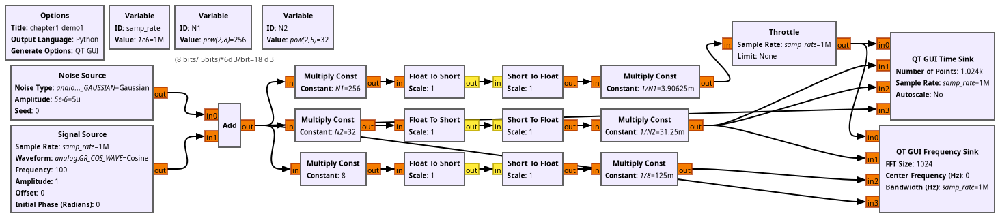

* ex1_11.grc: band-pass filtering of a noise source feeding the sound card

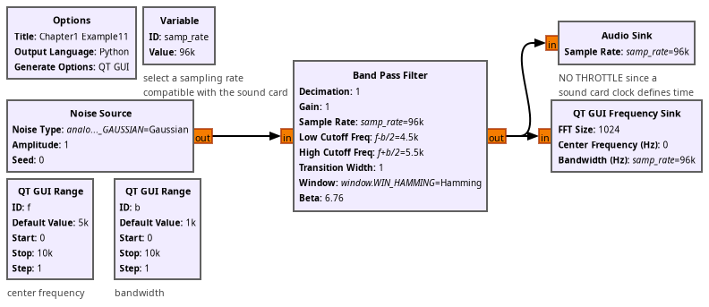
