## Examples for chapter 2: hardware

* ex2_01.grc: double-sideband AM modulation and demodulation

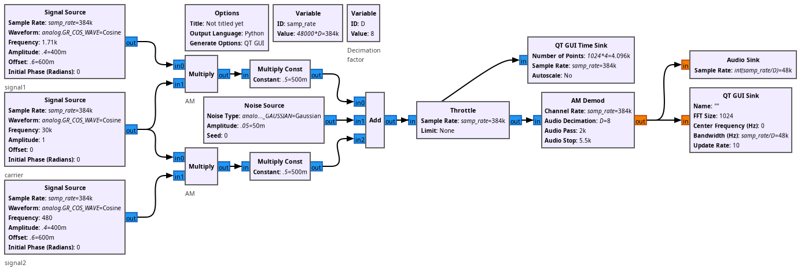

* ex2_02.grc: RTL-SDR ACARS reception using AM demodulation of aircraft
broadcast signals. Assumes the Out of Tree block gr-acars was compiled and
installed manually (https://sourceforge.net/projects/gr-acars/)

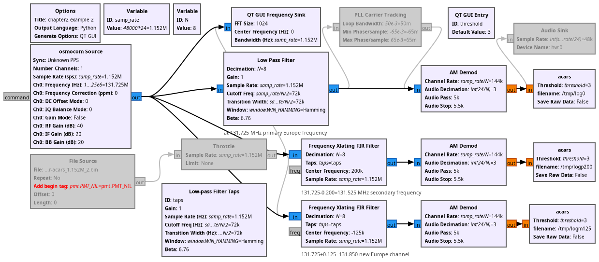

* ex2_03.grc: Narrow Band FM (NBFM) emitter and receiver simulation, relevant
for ham radio signal reception

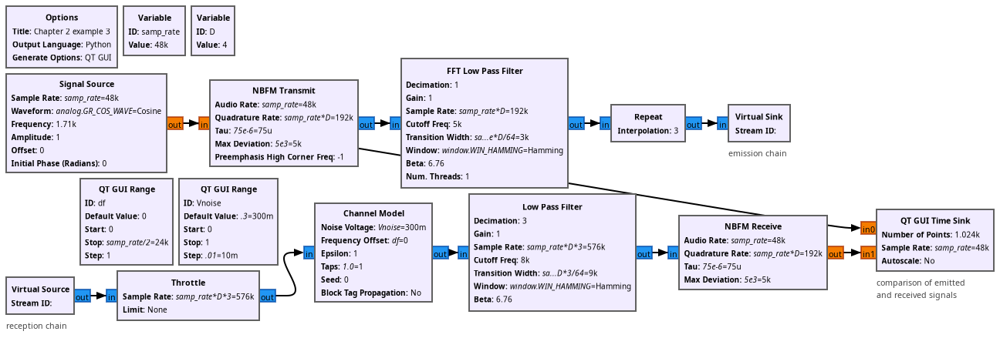

* ex2_04.grc: Wide Band FM (WBFM) transmitter and receiver, FM capture effect
demonstration (synthetic signals)

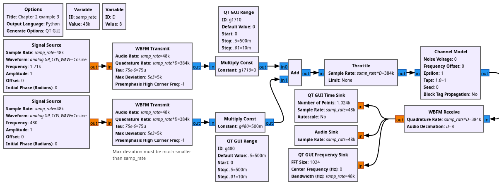

* ex2_05.grc: FM band spectrum display (RTL-SDR active, Adalm-Pluto commented)

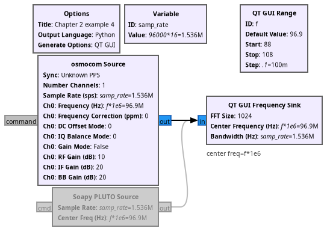

* ex2_06.grc: FM band spectrum display (RTL-SDR commented, Adalm-Pluto active)

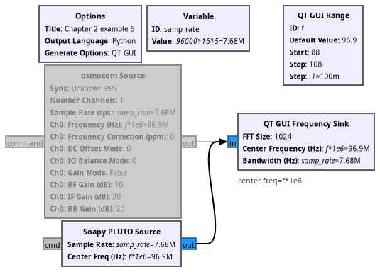

* ex2_07.grc: RTL-SDR commercial FM signal demodulation and output to sound card

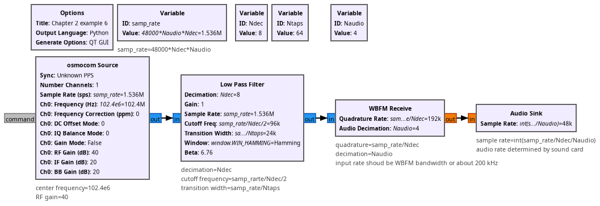

* ex2_09.grc: RTL-SDR reception of commercial FM signal for waterfall display
of the sub-signals (sterereo tone, left-right signal, RDS digital signal)

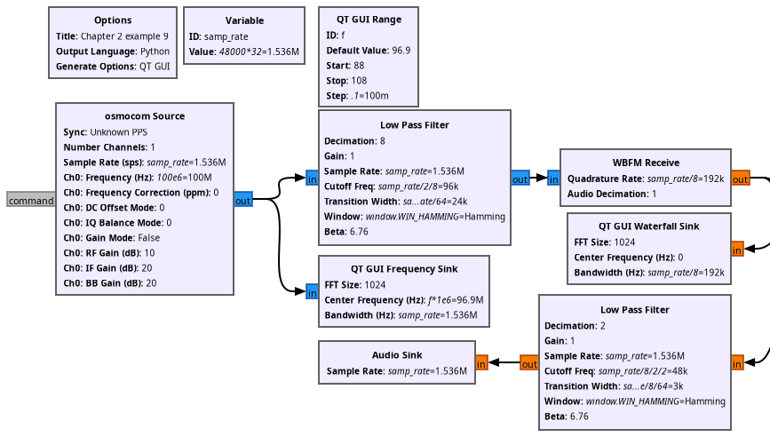

* ex2_10.grc: RTL-SDR reception of a phase-modulated (BPSK) signal broadcast in
the European ISM band and demodulated using a Costas loop

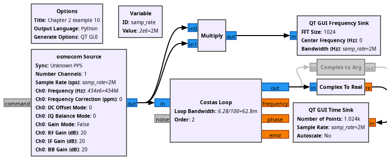

* ex2_11.grc: RTL-SDR reception of a commercial FM signal and demodulation of
the BPSK RDS sub-signal

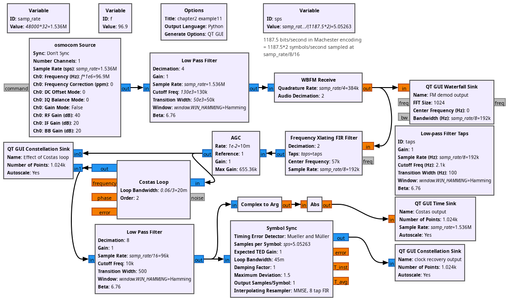

* ex2_12.grc: GPS recorded signal display by collapsing energy in the carrier
by despreading the BPSK signal by squaring the signal

* ex2_13.grc: GPS recorded signal display by collapsing energy in the carrier
by despreading the BPSK signal by squaring the signal (zoom on the spectrum by
decimation)

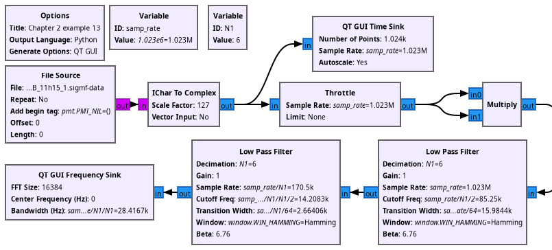

* ex2_14.grc: spectral occupation of AM, FM and PM (synthetic signals)

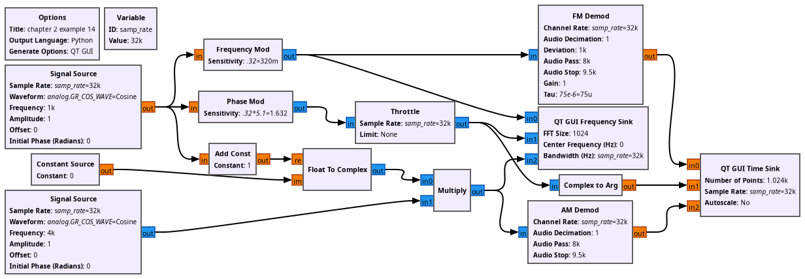

* ex2_15.grc: single-sideband AM modulation (spectral occupation)

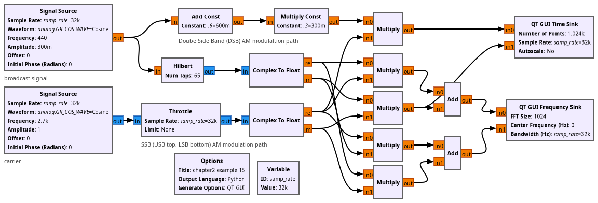

* ex2_16.grc: RTL-SDR reception of GRAVES continuous wave (CW) signal and
software super-heteordyne architecture to reject LO leakage at DC

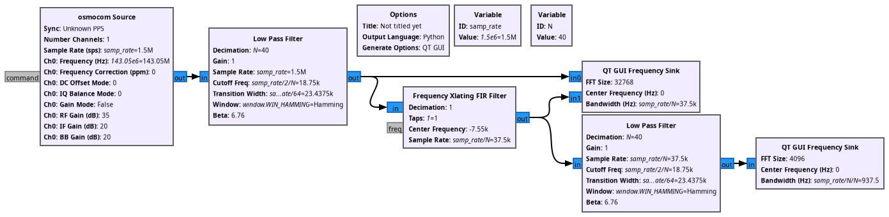
