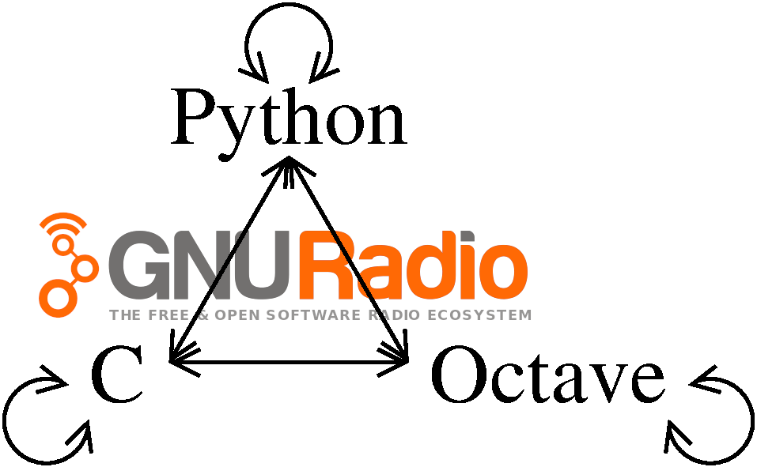
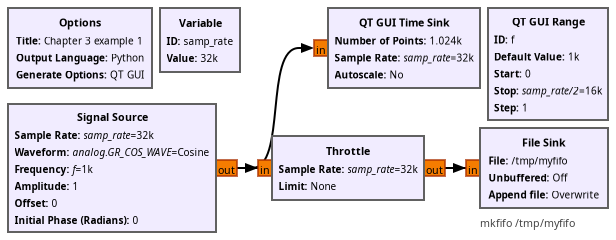
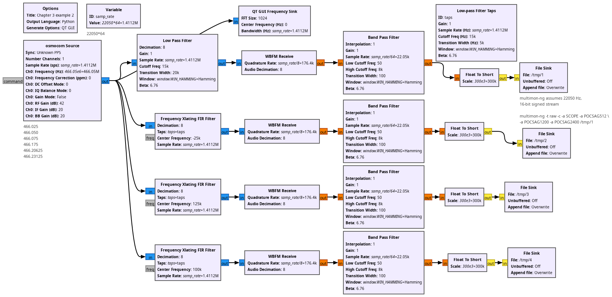
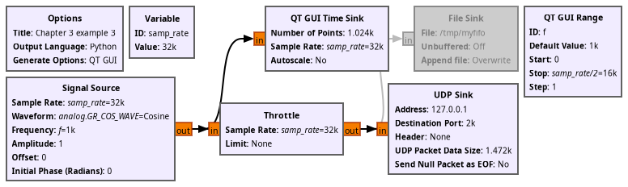
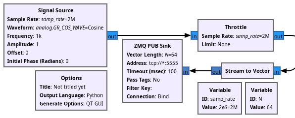
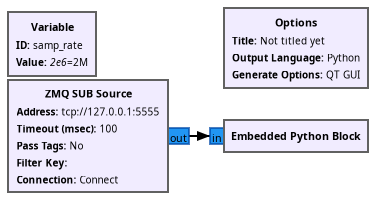

## Examples for chapter 3: communication

Communication between GNU Radio, Bash/shell, Python and GNU Octave through named pipe, TCP, UDP, 0MQ, XMLRPC...

The objective is to demonstrate how GNU Radio efficiently benefits from external tools for either completing 
processing (streaming from GNU Radio pre-processing to external tools) or for external tools to control the flowgraph 
behaviour. While other chapters are mostly operating system agnostic, this chapter will most probably only run
on Unix flavors (GNU Linux, \*BSD, possibly Mac OS X) if only for running named pipe examples.

* ex3_01.grc: UNIX named pipe (FIFO) communication, assuming */tmp/myfifo* was created using ``mkfifo /tmp/myfifo``

* ex3_02.grc: RTL-SDR reception and multichannel POCSAG demodulation using an external tool (``multimon-ng``) fed through named pipes (FIFO)

* ex3_03.grc: UDP/IP (non-blocking) communication

* ex3_07.grc: Zero-MQ PUBlish (non-blocking) emitter...

* ex3_08.grc: ... and accompanying Zero-MQ SUBscribe receiver with the display of the block size 
in a custom Python Block

