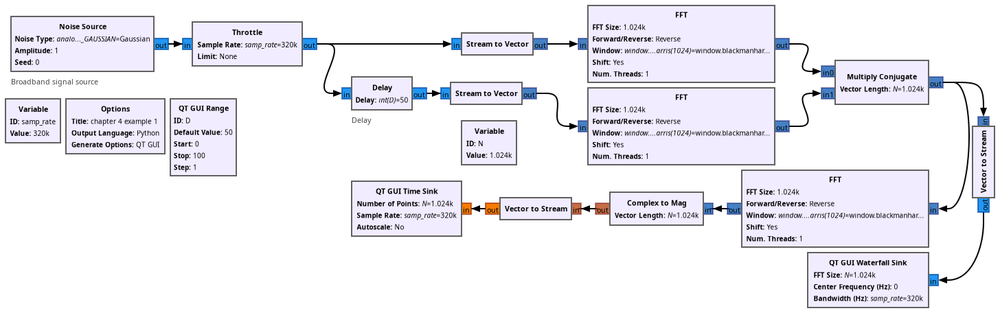
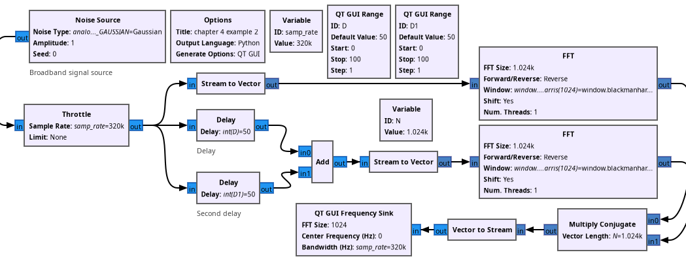
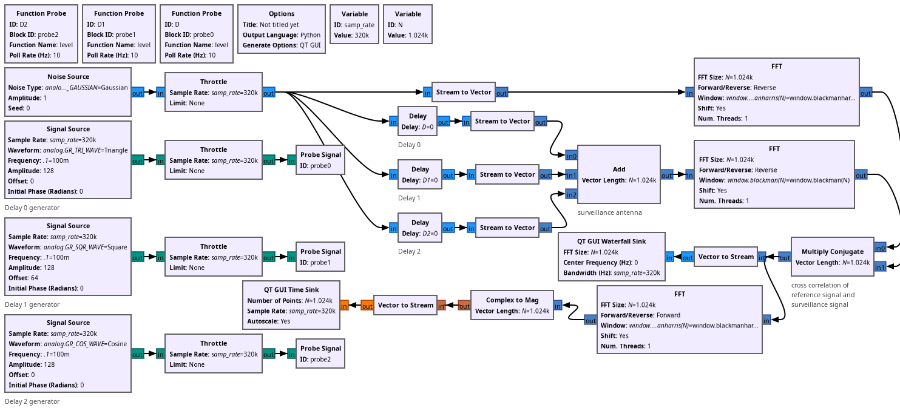
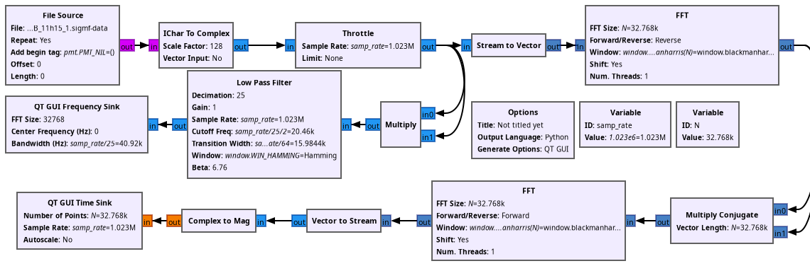
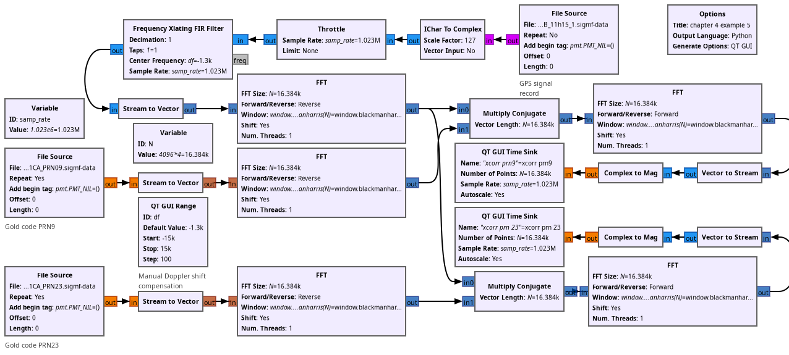
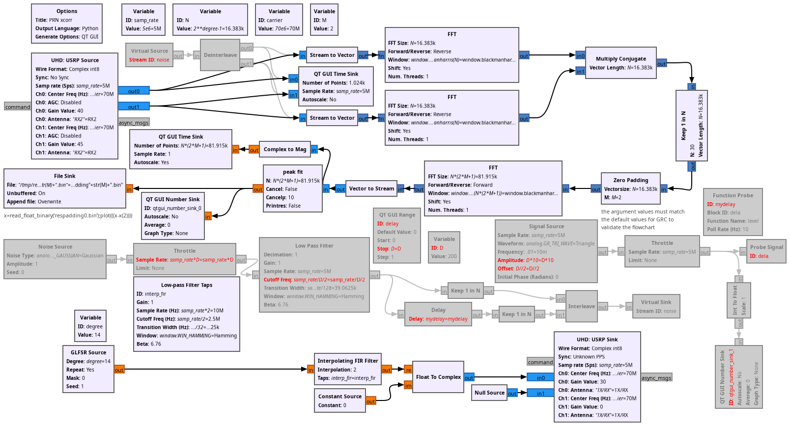

## Examples for chapter 4: RADAR

* ex4_01.grc: correlation demonstration with a single target delayed manually
with a slider (synthetic data)

* ex4_02.grc: correlation demonstration with two targets delayed manually with
sliders (synthetic data)

* ex4_03.grc: correlation demonstration with three targets delayed automatically
with probe functions (synthetic data)

* ex4_04.grc: autocorrelation v.s squared BPSK signal demonstration with
recorded GPS signals

* ex4_05.grc: cross-correlation between Gold code sequences and GPS recorded
signals with manual Doppler shift compensation using a slider

* ex4_06.grc: sub-sampling period fine delay measurement by zero-padding and
parabolic fit (custom blocks) of a GLFSR transmitted signal

