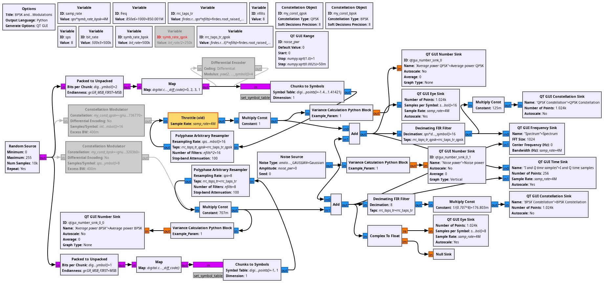
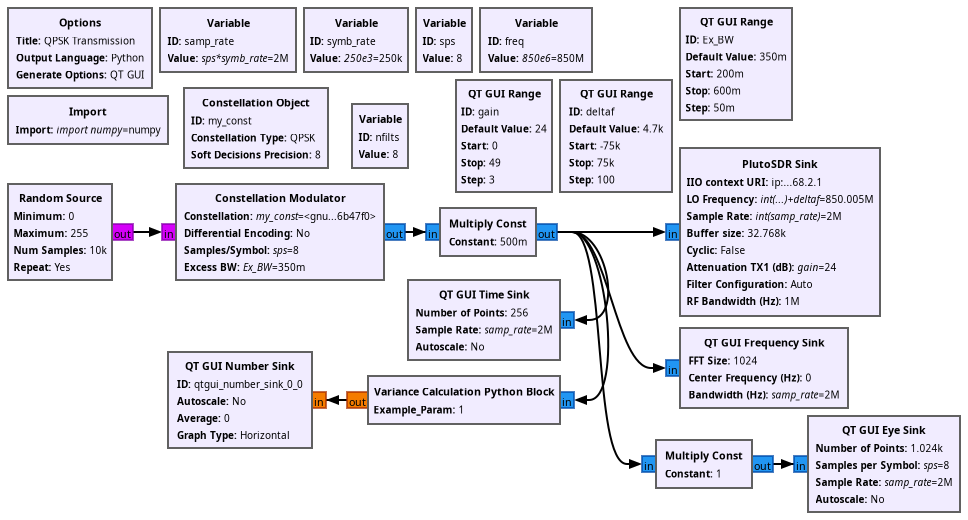
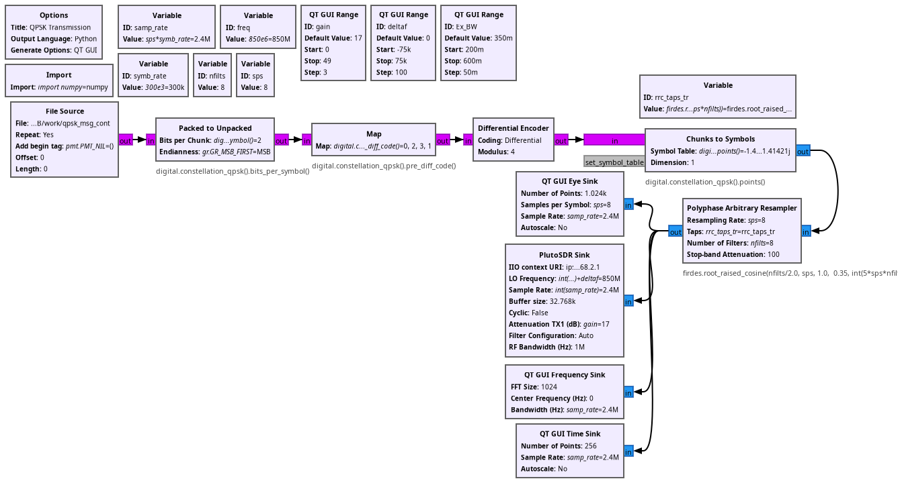
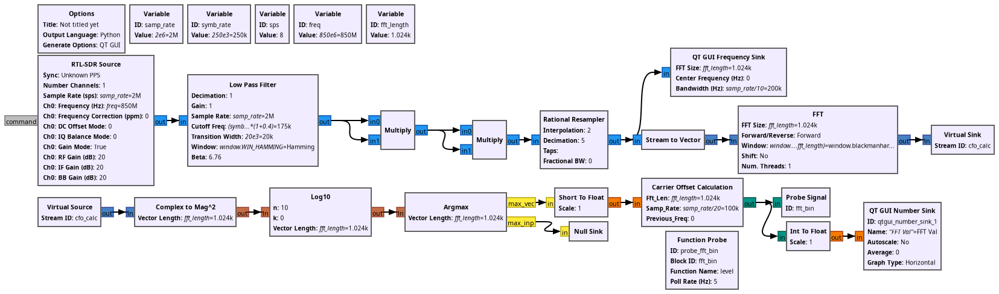
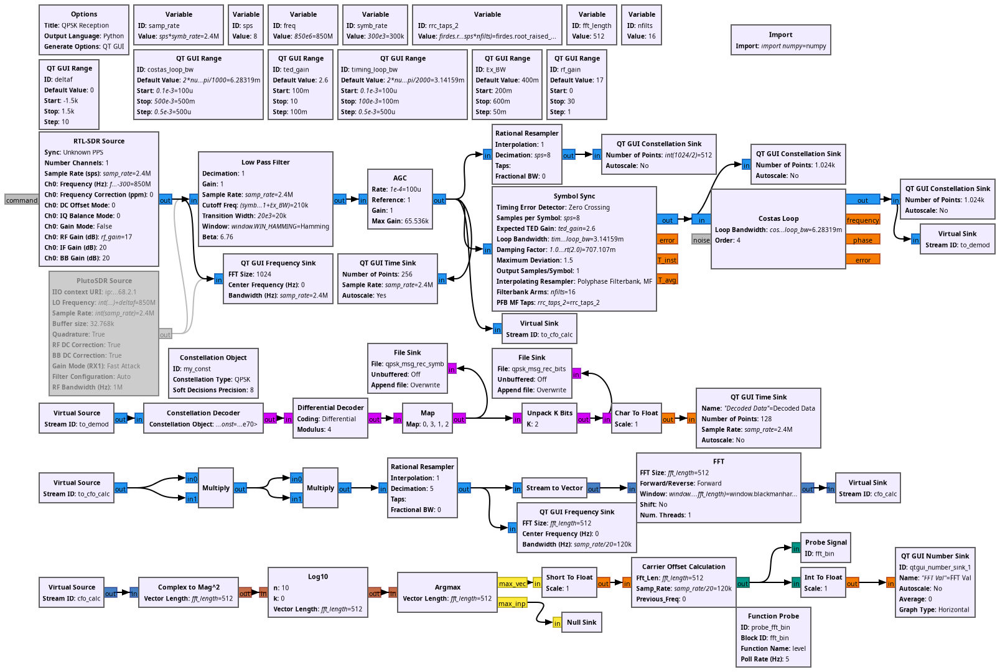
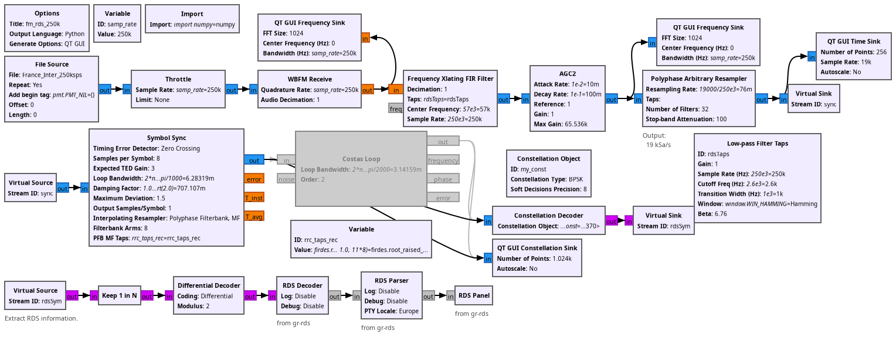

## Examples for chapter 5: QPSK MoDem

* ex_fig_5_6.grc



* ex_fig_5_7.grc



* ex_fig_5_8.grc



* ex_fig_5_12.grc: QPSK coarse frequency offset determination



* ex_fig_5_25_26_27.grc: QPSK decoding



* ex_fig_5_28.grc: RDS (BPSK) decoding. Assumes gr-rds has been compiled and installed (
For GNU Radio 3.10:
```
git clone https://github.com/bastibl/gr-rds
cd gr-rds
git checkout remotes/origin/maint-3.10
mkdir -p build
cd build/
cmake ../
make -j8
sudo make install
```


