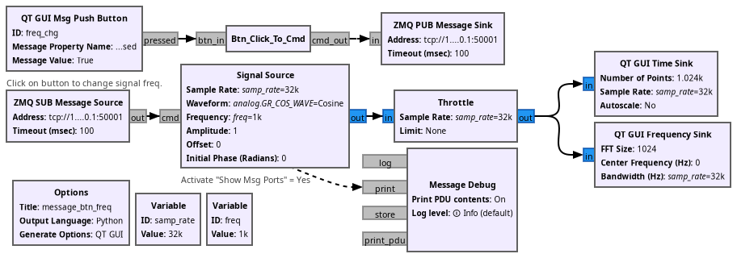
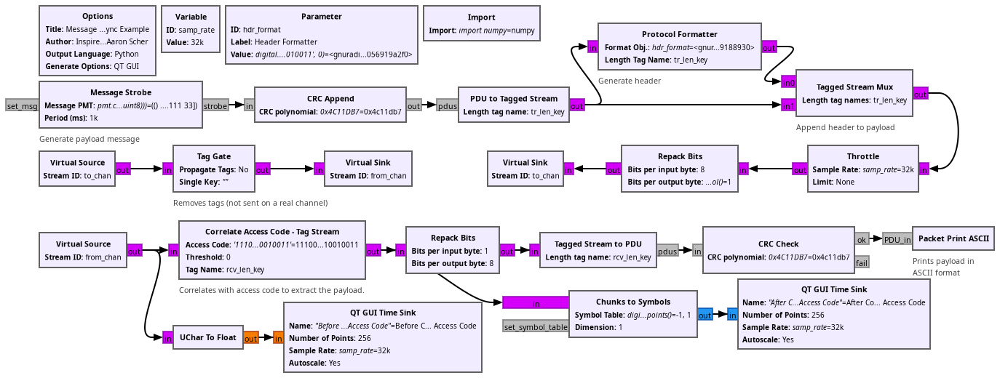
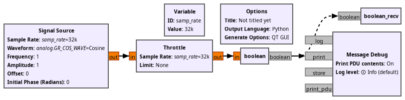
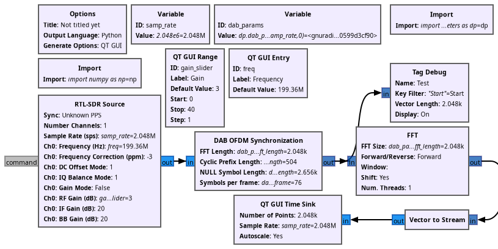
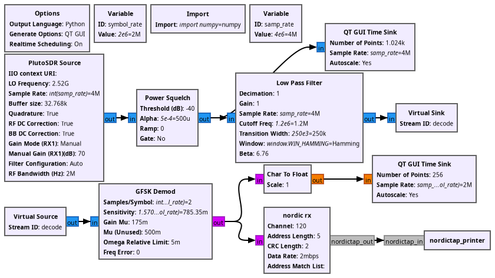
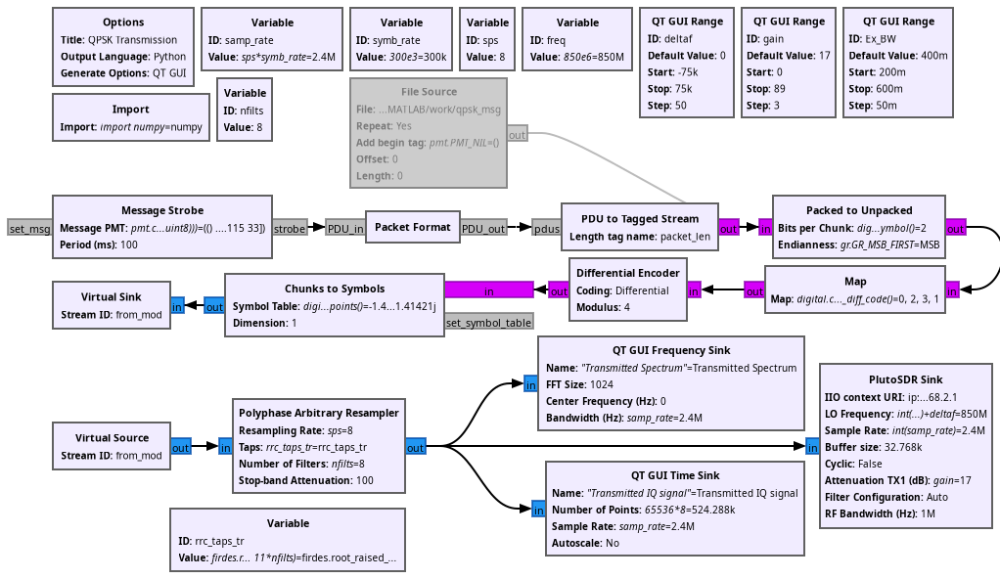

## Examples for chapter 6: tags and messages

* ex_fig_6_1.grc: message for changing the Signal Source frequency. Click on
the signal at the bottom of the chart to change the frequency with 1000 Hz 
steps.



* ex_fig_6_2.grc:



* ex6_03.grc: custom OOT block demonstrating message passing in C++, see the
``gr-message`` subdirectory for this custom block



* ex_fig_6_3.grc: ``gr-dab`` reception demonstration. Assumes the ``gr-dab`` 
OOT was installed. Use the following steps for GNU Radio 3.10
```
git clone https://github.com/hboeglen/gr-dab
cd gr-dab
git checkout maint-3.10
mkdir build
cd build
cmake ../ -DENABLE_DOXYGEN=OFF
make -j8
sudo make install
```


* ex_fig_6_4.grc: ``gr-nordic`` transmitter demonstration, assumes that the 
``gr-nordic`` OOT was installed. For GNU Radio 3.10:
```
git clone https://github.com/hboeglen/gr-nordic
cd gr-nordic/
git checkout remotes/origin/maint-3.10
mkdir build
cd build/
cmake ../
make -j12
sudo make install
```



* ex_fig_6_7.grc: ``gr-nordic`` receiver demonstration, assumes that the
``gr-nordic`` OOT was installed, see above.



* ex_fig_6_10.grc:



* ex_fig_6_11.grc:


