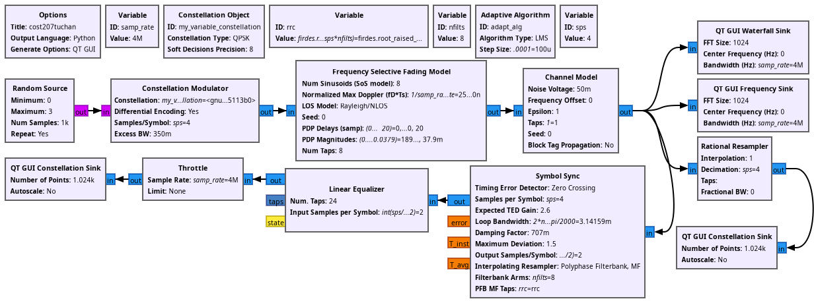
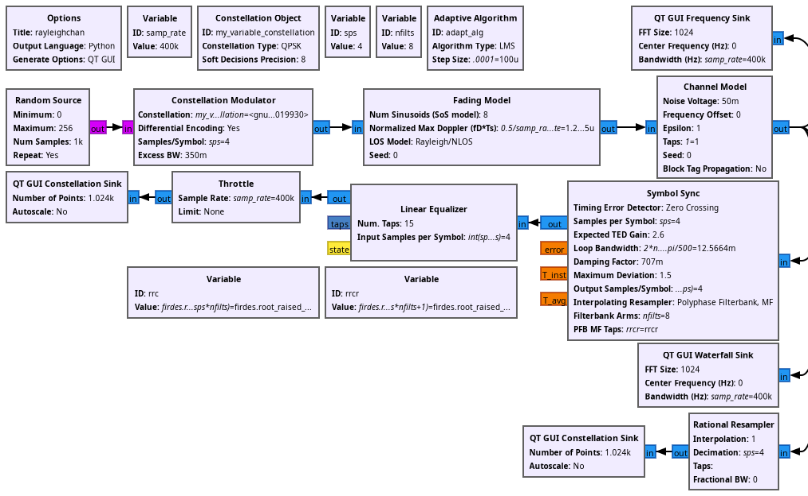
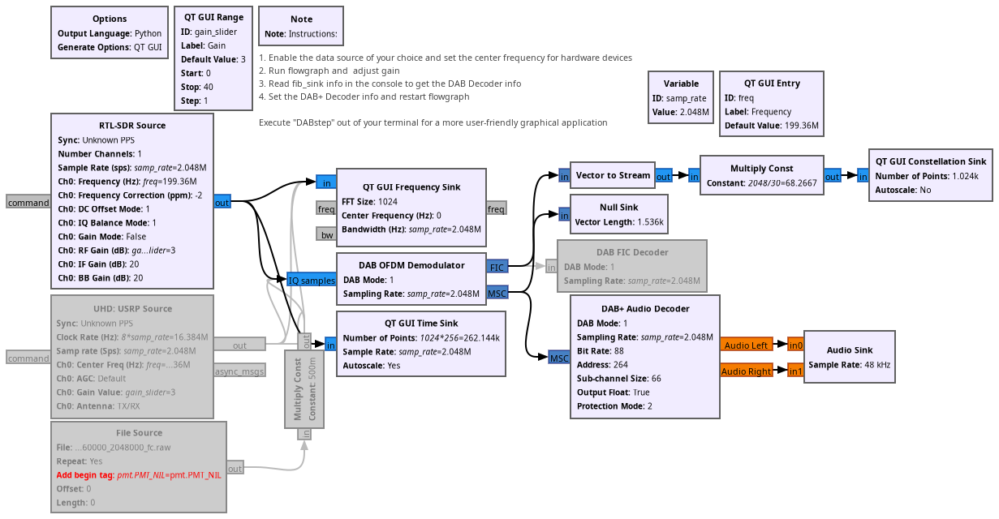
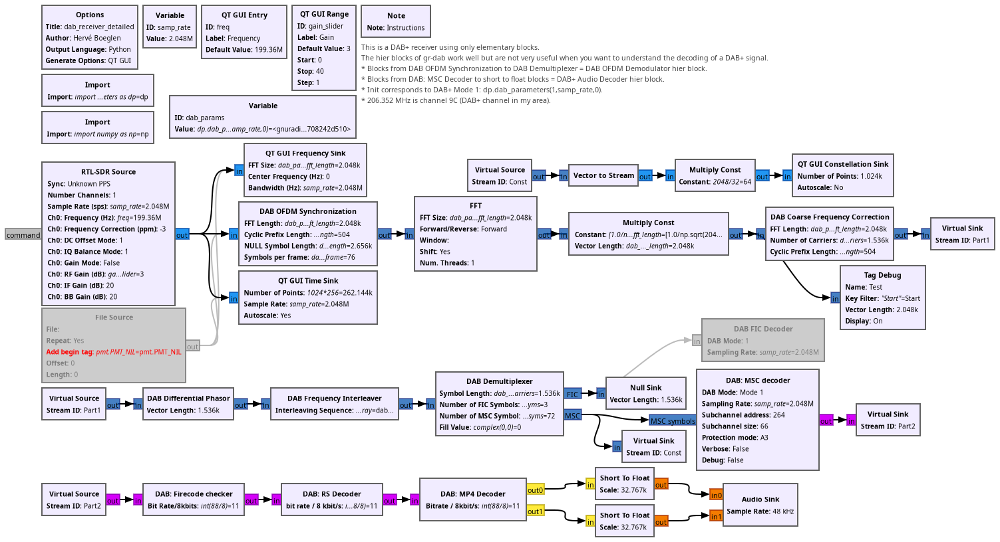

## Examples for chapter 7: DAB+

* cost207tuchan.grc: frequency selective fading channel model

* rayleighchan.grc: Rayleigh channel model

* ex_fig_7_24.grc: RTL-SDR based DAB+ audio decoder

* ex_fig_7_27.grc: RTL-SDR based DAB+ full decoder

